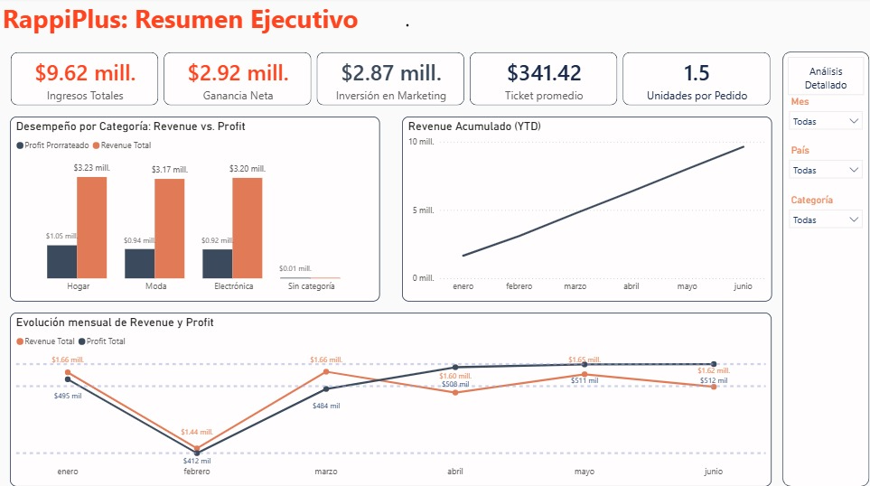
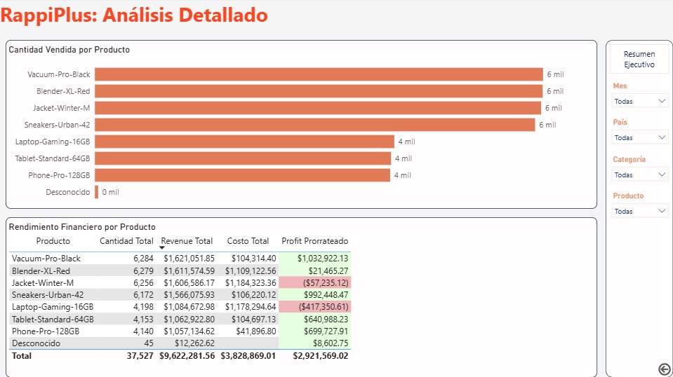
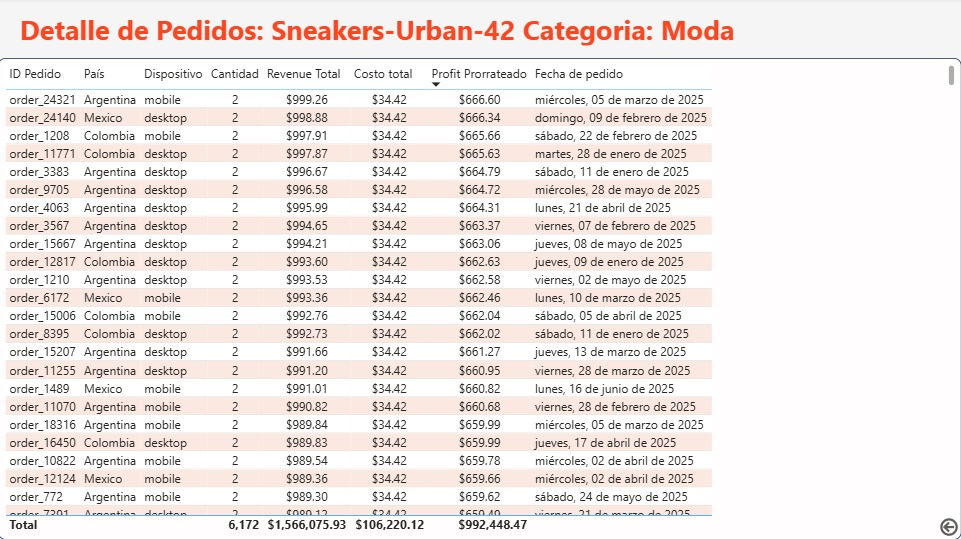

# RappiPlus: Revenue, Retention & Conversion Analysis

[](https://colab.research.google.com/github/DebbieJara/rappiplus-revenue-retention-analysis/blob/main/RappiPlus_Analisis.ipynb)


## The Business Problem

RappiPlus was generating strong headline revenue, but leadership had no clear view of which products were actually profitable, where customers dropped off during checkout, or whether a proposed checkout redesign was worth shipping.

## What I Did

Using order, catalog, and marketing data, I built a profitability model from scratch in Python, validated the conversion funnel and cohort retention in SQL, ran an A/B test on a proposed checkout redesign, and delivered an executive Power BI dashboard with product-level drill-through detail.

## What the Data Revealed

- The business is profitable overall: $9.62M revenue and $2.92M net profit (~30% margin).
- Two products, Jacket-Winter-M and Laptop-Gaming-16GB, operate at a loss (-$57,235 and -$417,351): Jacket-Winter-M is a top-4 seller by volume, while Laptop-Gaming-16GB sells at a mid-tier volume, a cost structure problem, not a demand problem.
- The checkout funnel loses the vast majority of users before purchase, with the sharpest drop (89.13%) occurring between entering payment info and completing the purchase.
- The proposed checkout redesign showed no statistically significant lift in conversion (p = 0.416), not enough evidence to justify shipping it.
- 45 orders (0.12% of volume) couldn't be matched to a catalog product, pointing to a data capture issue upstream.

The insight wasn't just "the business is profitable." It was: payment friction and two underpriced products were quietly eating into both conversion and margin.

## Technical Details

### Dataset

The order, catalog, marketing, and experiment datasets are sourced from cloud storage and are not included in this repository. Sources used:

| Source | Tables/Files |
|---|---|
| CSV (cloud storage) | orders, catalog, marketing, experiment_checkout_ui |
| CSV (included in `/data/`) | events, users, user_activity |

### Analytical Workflow

| Step | Description |
|---|---|
| 1. Data quality & cleaning | Nulls, duplicates, text inconsistencies, and outliers reviewed and resolved across all datasets |
| 2. Profitability & sales behavior | Revenue, cost, marketing spend, and net profit KPIs; median-based average ticket after outlier removal |
| 3. Conversion funnel | Users counted only if they completed the full sequence, validated in chronological order |
| 4. Cohort retention | Weekly retention by monthly cohort |
| 5. A/B test | Two-proportion z-test on a proposed checkout redesign |
| 6. Executive dashboard | Power BI dashboard with KPIs, category/product comparisons, and drill-through detail |

### Tools

| Stage | Tool | Detail |
|---|---|---|
| Cleaning & EDA | Python | pandas, numpy |
| Exploratory visualization | Python | matplotlib, seaborn |
| Statistical test | Python | statsmodels (two-proportion z-test) |
| Funnel & cohorts | SQL (DuckDB) | CTEs, JOINs, CASE WHEN, date functions |
| Dashboard | Power BI | DAX measures, conditional formatting, drill-through, button navigation |

### Files

```
rappiplus-revenue-retention-analysis/
  ├── README.md
  ├── RappiPlus_Analisis.ipynb
  ├── data/
  │   ├── events.csv
  │   ├── users.csv
  │   └── user_activity.csv
  └── dashboard/
      ├── dashboard_resumen_ejecutivo.png
      ├── dashboard_analisis_detallado.png
      └── dashboard_detalle_producto.png
```

Raw CSVs for orders, catalog, marketing, and experiment_checkout_ui are loaded directly from cloud storage within the notebook and are not stored in this repository. The exported SQL tables (events, users, user_activity) are included directly in `/data/`. Clean/processed versions of all datasets, plus the full `.pbix` dashboard file, are available in the [Google Drive folder](https://drive.google.com/drive/folders/1E6tyQ_wmgoAgn7QDM-e2uzmKT-6JRm_J?usp=drive_link) for reference.

## Dashboard

The full interactive dashboard (with drill-through and filters) is available as a downloadable `.pbix` file, along with the clean CSVs:

🔗 [Download dashboard (.pbix) and clean CSVs](https://drive.google.com/file/d/1iVvas_At1xCuqTi11TJoM9vpaUSZEGI9/view?usp=sharing)

**Executive Summary**


**Detailed Analysis**


**Product Detail (drill-through)**


---

By Deborah Jara | People & Learning Analytics · Business Intelligence | Mexico

[LinkedIn](https://linkedin.com/in/deborahjara) · [GitHub](https://github.com/DebbieJara)
